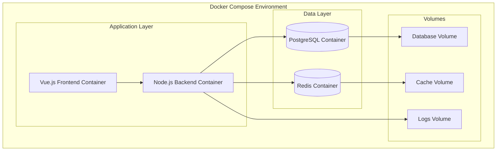
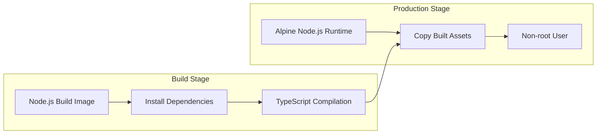
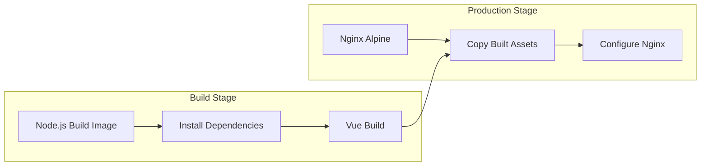

# Design Document

## Overview

Дизайн контейниризации для системы оптимизации поиска работы основан на микросервисной архитектуре с использованием Docker и Docker Compose. Решение включает в себя многоэтапную сборку Docker образов, отдельные конфигурации для development и production окружений, а также полную изоляцию сервисов.

Основные принципы дизайна:

- Минимальный размер production образов через multi-stage build
- Безопасность через использование non-root пользователей
- Персистентность данных через Docker volumes
- Автоматическое восстановление сервисов
- Простота локальной разработки

## Architecture

### Container Architecture



### Multi-Stage Build Strategy

#### Backend Build



#### Frontend Build



## Components and Interfaces

### 1. Backend Container

**Dockerfile Structure:**

- **Build Stage**: Использует `node:18-alpine` для сборки TypeScript кода
- **Production Stage**: Использует `node:18-alpine` с минимальными зависимостями
- **Security**: Создает и использует non-root пользователя `appuser`
- **Health Check**: Реализует HTTP health check endpoint

**Key Features:**

- Multi-stage build для оптимизации размера
- Кэширование слоев Docker для быстрой пересборки
- Правильная обработка сигналов для graceful shutdown
- Логирование в stdout/stderr для Docker logs

### 2. Database Container

**PostgreSQL Configuration:**

- Использует официальный образ `postgres:15-alpine`
- Автоматическая инициализация схемы через init scripts
- Персистентное хранение данных через named volumes
- Настройки производительности для разных окружений

### 3. Frontend Container

**Dockerfile Structure:**

- **Build Stage**: Использует `node:18-alpine` для сборки Vue приложения
- **Production Stage**: Использует `nginx:alpine` для раздачи статических файлов
- **Security**: Настройка Nginx с безопасными заголовками
- **Configuration**: Настройка проксирования запросов к API

**Key Features:**

- Multi-stage build для минимизации размера образа
- Оптимизация статических ресурсов
- Конфигурация Nginx для SPA приложения
- Поддержка HTTPS

### 4. Cache Container

**Redis Configuration:**

- Использует официальный образ `redis:7-alpine`
- Конфигурация для оптимальной производительности
- Персистентное хранение для production
- Memory-only режим для development

### 5. Docker Compose Configurations

**Development Configuration (`docker-compose.dev.yml`):**

- Hot reload через bind mounts
- Открытые порты для debugging
- Расширенное логирование
- Автоматический restart

**Production Configuration (`docker-compose.prod.yml`):**

- Оптимизированные настройки производительности
- Ограничения ресурсов
- Health checks и restart policies
- Безопасные настройки сети

## Data Models

### Environment Variables Structure

```typescript
interface ContainerEnvironment {
  // Application
  NODE_ENV: 'development' | 'production' | 'test';
  PORT: number;

  // Database
  DATABASE_URL: string;
  DB_HOST: string;
  DB_PORT: number;
  DB_NAME: string;
  DB_USER: string;
  DB_PASSWORD: string;

  // Cache
  REDIS_URL: string;
  REDIS_HOST: string;
  REDIS_PORT: number;

  // Security
  JWT_SECRET: string;

  // Application specific
  MAX_FILE_SIZE: number;
  LOG_LEVEL: string;
}
```

### Volume Configuration

```yaml
volumes:
  postgres_data:
    driver: local
  redis_data:
    driver: local
  app_logs:
    driver: local
```

## Error Handling

### Container Health Monitoring

1. **Application Health Check**
   - HTTP endpoint `/health` для проверки состояния
   - Проверка подключения к базе данных и Redis
   - Timeout: 30 секунд, interval: 30 секунд

2. **Database Health Check**
   - Встроенная проверка PostgreSQL
   - Проверка готовности к принятию соединений

3. **Cache Health Check**
   - Redis ping команда
   - Проверка доступности памяти

### Restart Policies

- **Application**: `restart: unless-stopped`
- **Database**: `restart: unless-stopped`
- **Cache**: `restart: unless-stopped`

### Error Recovery

1. **Graceful Shutdown**
   - Обработка SIGTERM сигналов
   - Закрытие активных соединений
   - Сохранение состояния перед остановкой

2. **Automatic Recovery**
   - Автоматический перезапуск при сбоях
   - Проверка зависимостей перед запуском
   - Exponential backoff для повторных попыток

## Testing Strategy

### Container Testing

1. **Build Testing**
   - Проверка успешной сборки образов
   - Валидация размера образов
   - Проверка безопасности образов

2. **Integration Testing**
   - Тестирование взаимодействия между контейнерами
   - Проверка сетевого взаимодействия
   - Тестирование персистентности данных

3. **Performance Testing**
   - Измерение времени запуска контейнеров
   - Тестирование под нагрузкой
   - Мониторинг использования ресурсов

### Development Workflow Testing

1. **Hot Reload Testing**
   - Проверка автоматического обновления кода
   - Тестирование сохранения состояния при изменениях

2. **Database Migration Testing**
   - Проверка автоматического применения миграций
   - Тестирование rollback процедур

### Production Deployment Testing

1. **Zero-Downtime Deployment**
   - Тестирование rolling updates
   - Проверка health checks во время обновления

2. **Backup and Recovery**
   - Тестирование резервного копирования данных
   - Проверка процедур восстановления

## Security Considerations

### Container Security

1. **Non-root User**
   - Все контейнеры запускаются от имени non-root пользователей
   - Минимальные права доступа к файловой системе

2. **Image Security**
   - Использование официальных базовых образов
   - Регулярное обновление базовых образов
   - Сканирование на уязвимости

3. **Network Security**
   - Изоляция сетей между сервисами
   - Минимальное количество открытых портов
   - Использование internal networks для межсервисного взаимодействия

### Secrets Management

1. **Environment Variables**
   - Использование Docker secrets для чувствительных данных
   - Отдельные файлы .env для разных окружений

2. **Database Credentials**
   - Генерация случайных паролей
   - Ротация credentials в production

## Performance Optimization

### Build Optimization

1. **Layer Caching**
   - Оптимальный порядок команд в Dockerfile
   - Использование .dockerignore для исключения ненужных файлов

2. **Multi-stage Benefits**
   - Исключение dev dependencies из production образа
   - Минимальный размер финального образа

### Runtime Optimization

1. **Resource Limits**
   - Настройка memory и CPU limits
   - Оптимизация для различных окружений

2. **Database Performance**
   - Настройка PostgreSQL для контейнерной среды
   - Оптимизация connection pooling

3. **Cache Performance**
   - Настройка Redis для оптимальной производительности
   - Правильная конфигурация memory policies
