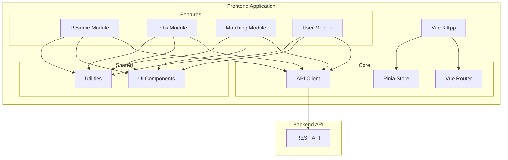
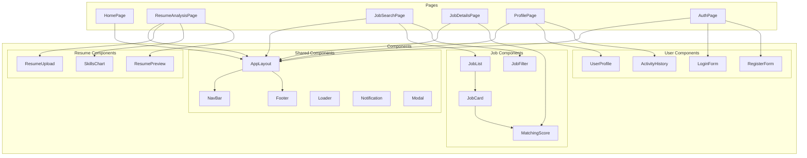

# Design Document

## Overview

Дизайн фронтенд части системы оптимизации поиска работы основан на современной архитектуре с использованием Vue 3, Composition API и TypeScript. Приложение будет построено по принципу компонентного подхода с четким разделением ответственности между компонентами, сервисами и хранилищем данных.

Основные принципы дизайна:

- Компонентная архитектура с переиспользуемыми UI-компонентами
- Реактивное управление состоянием с использованием Pinia
- Типизация с помощью TypeScript для улучшения разработки и поддержки
- Адаптивный дизайн для поддержки различных устройств
- Оптимизация производительности с использованием ленивой загрузки

## Architecture

### Frontend Architecture



### Component Structure



## Components and Interfaces

### 1. Core Components

#### App Layout

- **Назначение**: Основной макет приложения с навигацией и футером
- **Состав**:
  - NavBar: Навигационная панель с меню
  - RouterView: Область для отображения страниц
  - Footer: Нижняя часть с информацией
- **Особенности**: Адаптивный дизайн, поддержка темной темы

#### Router Configuration

- **Маршруты**:
  - `/`: Главная страница
  - `/resume`: Анализ резюме
  - `/jobs`: Поиск вакансий
  - `/jobs/:id`: Детали вакансии
  - `/profile`: Личный кабинет
  - `/auth`: Авторизация/регистрация
- **Защита маршрутов**: Middleware для проверки авторизации
- **Ленивая загрузка**: Динамический импорт компонентов страниц

### 2. Feature Components

#### Resume Analysis Module

- **ResumeUpload**: Компонент для загрузки и анализа резюме
  - Поддержка drag-and-drop
  - Предпросмотр файла
  - Валидация формата
- **SkillsChart**: Визуализация навыков из резюме
  - Круговая диаграмма по категориям навыков
  - Уровни владения навыками
  - Сравнение с требованиями рынка
- **RecommendationList**: Список рекомендаций по улучшению резюме

#### Job Search Module

- **JobFilter**: Фильтры для поиска вакансий
  - По навыкам
  - По локации
  - По уровню опыта
  - По зарплате
- **JobList**: Список вакансий с пагинацией
- **JobCard**: Карточка вакансии с кратким описанием
- **JobDetails**: Детальная информация о вакансии
  - Полное описание
  - Требуемые навыки
  - Процент соответствия с резюме
  - Контактная информация

#### User Module

- **AuthForms**: Формы авторизации и регистрации
- **UserProfile**: Профиль пользователя с возможностью редактирования
- **ActivityHistory**: История действий пользователя
  - Просмотренные вакансии
  - Загруженные резюме
  - Статистика соответствия

### 3. Shared Components

#### UI Components

- **Button**: Кастомизируемая кнопка с различными вариантами
- **Input**: Текстовое поле с валидацией
- **Select**: Выпадающий список с поиском
- **Modal**: Модальное окно для диалогов
- **Notification**: Компонент для отображения уведомлений
- **Loader**: Индикатор загрузки
- **Badge**: Метка для отображения статусов
- **Card**: Контейнер для информации
- **Tabs**: Компонент с вкладками

## Data Models

### Frontend Data Models

```typescript
// Модель пользователя
interface User {
  id: string;
  email: string;
  firstName: string;
  lastName: string;
  role: 'jobseeker' | 'employer';
  createdAt: Date;
  updatedAt: Date;
}

// Модель резюме
interface Resume {
  id: string;
  userId: string;
  title: string;
  content: string;
  skills: Skill[];
  experience: Experience[];
  education: Education[];
  languages: Language[];
  createdAt: Date;
  updatedAt: Date;
}

// Модель навыка
interface Skill {
  id: string;
  name: string;
  category: string;
  level: number; // 1-5
}

// Модель опыта работы
interface Experience {
  id: string;
  company: string;
  position: string;
  startDate: Date;
  endDate: Date | null;
  description: string;
  skills: string[];
}

// Модель вакансии
interface Job {
  id: string;
  title: string;
  company: string;
  location: string;
  description: string;
  requirements: string[];
  skills: Skill[];
  salary: {
    min: number;
    max: number;
    currency: string;
  };
  employmentType: 'full-time' | 'part-time' | 'contract' | 'internship';
  remoteOption: boolean;
  createdAt: Date;
  updatedAt: Date;
}

// Модель соответствия
interface Matching {
  resumeId: string;
  jobId: string;
  score: number; // 0-100
  matchedSkills: {
    skill: string;
    weight: number;
  }[];
  missingSkills: string[];
  recommendations: string[];
}
```

### Store Structure (Pinia)

```typescript
// User Store
interface UserState {
  currentUser: User | null;
  isAuthenticated: boolean;
  loading: boolean;
  error: string | null;
}

// Resume Store
interface ResumeState {
  resumes: Resume[];
  currentResume: Resume | null;
  analysis: {
    skills: Skill[];
    recommendations: string[];
  } | null;
  loading: boolean;
  error: string | null;
}

// Job Store
interface JobState {
  jobs: Job[];
  currentJob: Job | null;
  filters: {
    skills: string[];
    location: string;
    experienceLevel: string;
    salaryRange: [number, number];
  };
  pagination: {
    page: number;
    limit: number;
    total: number;
  };
  loading: boolean;
  error: string | null;
}

// Matching Store
interface MatchingState {
  matchings: Record<string, Matching>; // jobId -> Matching
  loading: boolean;
  error: string | null;
}
```

## API Integration

### API Client

```typescript
// API Client с использованием Axios
class ApiClient {
  // Аутентификация
  login(email: string, password: string): Promise<User>;
  register(userData: Partial<User>, password: string): Promise<User>;
  logout(): Promise<void>;

  // Резюме
  uploadResume(file: File): Promise<Resume>;
  getResumeAnalysis(resumeId: string): Promise<any>;
  getUserResumes(): Promise<Resume[]>;

  // Вакансии
  getJobs(filters: any, pagination: any): Promise<{ jobs: Job[]; total: number }>;
  getJobById(id: string): Promise<Job>;
  getMatchingScore(resumeId: string, jobId: string): Promise<Matching>;

  // Пользователь
  getUserProfile(): Promise<User>;
  updateUserProfile(data: Partial<User>): Promise<User>;
  getUserActivity(): Promise<any>;
}
```

## Error Handling

### Frontend Error Handling Strategy

1. **API Errors**
   - Перехват ошибок с помощью Axios interceptors
   - Обработка HTTP статус-кодов
   - Отображение понятных сообщений пользователю

2. **Валидация форм**
   - Клиентская валидация с помощью Vuelidate
   - Отображение ошибок рядом с полями ввода
   - Предотвращение отправки невалидных данных

3. **Глобальная обработка ошибок**
   - Vue error handler для необработанных исключений
   - Логирование ошибок
   - Fallback UI для критических ошибок

4. **Offline режим**
   - Обнаружение отсутствия соединения
   - Кэширование данных для работы офлайн
   - Синхронизация при восстановлении соединения

## Testing Strategy

### Frontend Testing

1. **Unit Tests**
   - Тестирование отдельных компонентов с помощью Vue Test Utils
   - Тестирование хранилища Pinia
   - Тестирование утилит и хелперов

2. **Component Tests**
   - Тестирование взаимодействия компонентов
   - Проверка событий и пропсов
   - Тестирование жизненного цикла компонентов

3. **E2E Tests**
   - Тестирование пользовательских сценариев с помощью Cypress
   - Проверка интеграции с API (с использованием моков)
   - Тестирование на различных устройствах

## Performance Optimization

### Frontend Performance

1. **Code Splitting**
   - Разделение кода по маршрутам
   - Динамический импорт компонентов
   - Выделение общих библиотек в отдельные чанки

2. **Lazy Loading**
   - Ленивая загрузка компонентов
   - Ленивая загрузка изображений
   - Предзагрузка критических ресурсов

3. **Caching Strategy**
   - Кэширование API-ответов
   - Использование localStorage для персистентности
   - Стратегия кэширования для статических ресурсов

4. **Rendering Optimization**
   - Виртуальный скроллинг для длинных списков
   - Оптимизация реактивности с помощью shallowRef
   - Мемоизация вычисляемых свойств

## Accessibility

### Accessibility Features

1. **ARIA атрибуты**
   - Правильная семантическая разметка
   - Использование ARIA-ролей и атрибутов
   - Поддержка скринридеров

2. **Клавиатурная навигация**
   - Поддержка навигации с клавиатуры
   - Логический порядок табуляции
   - Видимый фокус на элементах

3. **Цветовой контраст**
   - Соответствие требованиям WCAG 2.1
   - Альтернативные режимы для людей с дальтонизмом
   - Достаточный контраст текста и фона

## Deployment Strategy

### Frontend Deployment

1. **Build Process**
   - Оптимизация сборки с Vite
   - Минификация и сжатие ресурсов
   - Генерация source maps для отладки

2. **CI/CD Pipeline**
   - Автоматическая сборка при коммите
   - Запуск тестов перед деплоем
   - Автоматический деплой на тестовую среду

3. **Hosting**
   - Размещение на CDN для быстрой доставки
   - Настройка кэширования на уровне сервера
   - Конфигурация HTTPS
