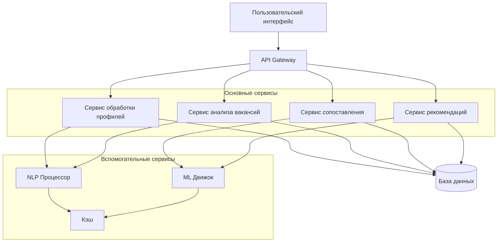

# Документ проектирования

## Обзор

Система оптимизации поиска работы представляет собой веб-приложение, которое использует технологии обработки естественного языка и машинного обучения для анализа соответствия резюме требованиям вакансий и предоставления персонализированных рекомендаций по улучшению профиля соискателя.

## Архитектура

Система построена по модульной архитектуре с четким разделением ответственности:



## Компоненты и интерфейсы

### 1. Сервис обработки профилей (Profile Service)

**Назначение**: Обработка и структурирование данных резюме

**Основные методы**:

- `parseResume(resumeText: string): ParsedProfile`
- `updateProfile(profileId: string, updates: ProfileUpdate): Profile`
- `getProfile(profileId: string): Profile`

**Интерфейсы**:

```typescript
interface ParsedProfile {
  personalInfo: PersonalInfo;
  skills: Skill[];
  experience: WorkExperience[];
  education: Education[];
  languages: Language[];
}

interface Skill {
  name: string;
  category: SkillCategory;
  proficiencyLevel: ProficiencyLevel;
  yearsOfExperience?: number;
}
```

### 2. Сервис анализа вакансий (Job Service)

**Назначение**: Извлечение и структурирование требований из описаний вакансий

**Основные методы**:

- `parseJobDescription(jobText: string): ParsedJob`
- `saveJob(userId: string, job: ParsedJob): SavedJob`
- `getUserJobs(userId: string): SavedJob[]`

**Интерфейсы**:

```typescript
interface ParsedJob {
  title: string;
  company: string;
  requirements: JobRequirement[];
  responsibilities: string[];
  benefits: string[];
}

interface JobRequirement {
  type: RequirementType;
  skill: string;
  importance: ImportanceLevel;
  isRequired: boolean;
}
```

### 3. Сервис сопоставления (Matching Service)

**Назначение**: Анализ соответствия профиля требованиям вакансии

**Основные методы**:

- `calculateMatch(profileId: string, jobId: string): MatchResult`
- `getDetailedAnalysis(profileId: string, jobId: string): DetailedMatch`

**Интерфейсы**:

```typescript
interface MatchResult {
  overallScore: number;
  categoryScores: CategoryScore[];
  matchedSkills: MatchedSkill[];
  missingRequirements: JobRequirement[];
}

interface CategoryScore {
  category: SkillCategory;
  score: number;
  weight: number;
}
```

### 4. Сервис рекомендаций (Recommendation Service)

**Назначение**: Генерация персонализированных рекомендаций по улучшению профиля

**Основные методы**:

- `generateRecommendations(profileId: string, jobId: string): Recommendation[]`
- `prioritizeRecommendations(recommendations: Recommendation[]): Recommendation[]`

**Интерфейсы**:

```typescript
interface Recommendation {
  type: RecommendationType;
  priority: Priority;
  description: string;
  actionItems: ActionItem[];
  estimatedImpact: number;
}

interface ActionItem {
  action: string;
  resources: Resource[];
  timeEstimate: string;
}
```

## Модели данных

### Пользователь

```typescript
interface User {
  id: string;
  email: string;
  profile: Profile;
  savedJobs: SavedJob[];
  createdAt: Date;
  updatedAt: Date;
}
```

### Профиль

```typescript
interface Profile {
  id: string;
  userId: string;
  personalInfo: PersonalInfo;
  skills: Skill[];
  experience: WorkExperience[];
  education: Education[];
  languages: Language[];
  resumeText: string;
  lastUpdated: Date;
}
```

### Сохраненная вакансия

```typescript
interface SavedJob {
  id: string;
  userId: string;
  originalText: string;
  parsedJob: ParsedJob;
  lastMatchScore?: number;
  addedAt: Date;
}
```

### История сопоставлений

```typescript
interface MatchHistory {
  id: string;
  profileId: string;
  jobId: string;
  matchResult: MatchResult;
  recommendations: Recommendation[];
  createdAt: Date;
}
```

## Обработка ошибок

### Стратегия обработки ошибок

1. **Валидация входных данных**

   - Проверка формата загружаемых файлов
   - Валидация размера и содержимого текста
   - Санитизация пользовательского ввода

2. **Обработка ошибок NLP**

   - Fallback на базовые алгоритмы при сбоях ML-моделей
   - Логирование проблемных текстов для улучшения моделей
   - Уведомление пользователя о частичной обработке

3. **Системные ошибки**
   - Graceful degradation при недоступности внешних сервисов
   - Retry механизмы для временных сбоев
   - Мониторинг и алертинг критических компонентов

### Коды ошибок

```typescript
enum ErrorCode {
  INVALID_RESUME_FORMAT = "INVALID_RESUME_FORMAT",
  JOB_PARSING_FAILED = "JOB_PARSING_FAILED",
  MATCHING_SERVICE_UNAVAILABLE = "MATCHING_SERVICE_UNAVAILABLE",
  INSUFFICIENT_DATA = "INSUFFICIENT_DATA",
  RATE_LIMIT_EXCEEDED = "RATE_LIMIT_EXCEEDED",
}
```

## Стратегия тестирования

### 1. Модульное тестирование

- Тестирование каждого сервиса изолированно
- Мокирование внешних зависимостей
- Покрытие критических алгоритмов сопоставления

### 2. Интеграционное тестирование

- Тестирование взаимодействия между сервисами
- Проверка корректности обработки данных через всю цепочку
- Тестирование API endpoints

### 3. Тестирование NLP компонентов

- Набор тестовых резюме и вакансий с эталонными результатами
- Проверка качества извлечения навыков и требований
- Валидация точности алгоритмов сопоставления

### 4. Пользовательское тестирование

- A/B тестирование интерфейса
- Тестирование юзабилити с реальными пользователями
- Сбор обратной связи по качеству рекомендаций

### 5. Нагрузочное тестирование

- Тестирование производительности при обработке больших резюме
- Проверка масштабируемости системы
- Тестирование concurrent пользователей
